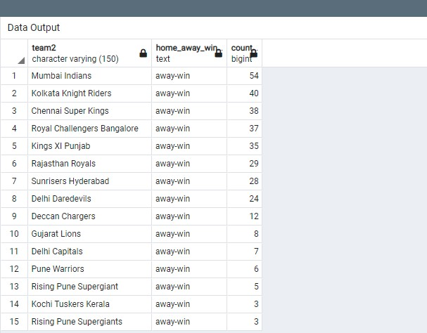

/*
About the Data

The first CSV file is for ball-by-ball data and it has information of all the 193468 balls bowled

between the years 2008 and 2020. It has 17 columns and below is the details of those 17

columns.
The second file contains match-wise data and has data of 816 IPL matches. This table has 17 columns and below is a 
short description of the columns in this table.
*/

1. Create a table named ‘matches’ with appropriate data types for columns
<pre>
Create Table matches (	  "id" INTEGER PRIMARY KEY NOT NULL, 
			  "city" varchar(20) NOT NUll,
			  "date" varchar(20),
			  "player_of_match" varchar(50),
			  "venue" text,
			  "neutral_venue" INTEGER,
			  "team1" varchar(150),
			  "team2" varchar(150),
			  "toss_winner" varchar(150),
			  "toss_decision" varchar(15),
			  "winner" varchar(150),
			  "result" varchar(15),
			  "result_margin" integer,
			  "eliminator" varchar(20),
			  "method" varchar(20),
			  "umpire1" varchar(50),
			  "umpire2" varchar(50)
			  );
</pre>

2. Create a table named ‘deliveries’ with appropriate data types for columns
<pre>
Create Table deliveries ( "id" INTEGER, 
			  "inning" INTEGER,
			  "over" INTEGER,
			  "ball" INTEGER,
			  "batsman" varchar(50),
			  "non_striker" varchar(50),
			  "bowler" varchar(50),
			  "batsman_runs" INTEGER,
			  "extra_runs" INTEGER,
			  "total_runs" INTEGER,
			  "is_wicket" INTEGER,
			  "dismissal_kind" varchar(25),
			  "player_dismissed" varchar(50),
			  "fielder" varchar(50),
			  "extras_type" varchar(20),
			  "batting_team" varchar(50),
			  "bowling_team" varchar(50)
			  );
					  
</pre>

3. Import data from CSV file "IPL_matches.csv" attached in resources to ‘matches’
<pre>
COPY matches FROM
'E:\cdrive\start_tech_inteern\sql\IPL_matches.csv' DELIMITER ',' CSV HEADER;
</pre>

4. Import data from CSV file "IPL_Ball.csv" attached in resources to ‘deliveries’
<pre>
COPY deliveries FROM
'E:\cdrive\start_tech_inteern\sql\IPL_Ball.csv' DELIMITER ',' CSV HEADER;
</pre>

4b. An overview of the datasets
<pre>
SELECT * 
FROM matches
LIMIT 5;

SELECT * 
FROM deliveries
LIMIT 5;

</pre>

5. Select the top 20 rows of the deliveries table.
<pre>
SELECT * 
FROM deliveries
LIMIT 20;

</pre>

6. Select the top 20 rows of the matches table.
<pre>
SELECT * 
FROM matches
LIMIT 20;

</pre>

7. Fetch data of all the matches played on 2nd May 2013.
/* My date is in Varchar datatype, so I will change it to date format and convert it to date datatype*/
<pre>
UPDATE matches
SET date = TO_DATE(date, 'DD-MM-YYYY');

Alter table matches
Alter column date SET DATA TYPE date
USING date::date;

SELECT * 
FROM matches
WHERE date = '2013-05-02';

</pre>

8. Fetch data of all the matches where the margin of victory is more than 100 runs.
<pre>
SELECT * 
FROM matches
WHERE result_margin > 100
ORDER BY result_margin DESC;

</pre>

9. Fetch data of all the matches where the final scores of both teams tied and order it in descending order of the date.
<pre>
SELECT * 
FROM matches
WHERE result = 'tie'
ORDER BY date DESC;

</pre>

10. Get the count of cities that have hosted an IPL match.
<pre>
SELECT COUNT(DISTINCT city) city_count
FROM matches

</pre>

/* If you want to analyze data further you can write your own queries.*/

11. Get the number of times each city have hosted an IPL match, in descending order.
<pre>
SELECT  city,
	COUNT(*) host_count
FROM matches
GROUP BY city
ORDER BY 2 DESC;

</pre>

12. Number of games played each year
<pre>
SELECT  EXTRACT('year' from date),
	COUNT(*) num_of_games
FROM matches
GROUP BY 1
ORDER BY 1;

</pre>

13. Get the number of times a player has been named player of match, in descending order.
<pre>
SELECT  player_of_match,
	COUNT(*) host_count
FROM matches
GROUP BY 1
ORDER BY 2 DESC;

</pre>

14. Return a query showing home and away wins.
<pre>
WITH home_away as (
	Select  city,
		venue,
		team1,
		neutral_venue,
		CASE 	WHEN (neutral_venue=0) AND (team1= winner) THEN 'home-win'
			WHEN (neutral_venue=0) AND (team2 = winner) THEN 'away-win'
			WHEN (neutral_venue=1) AND (team1 = winner) THEN 'neutral-home-win'
			WHEN (neutral_venue=1) AND (team2 = winner) THEN 'neutral-away-win'
			ELSE 'tie'
		END AS "home_away_win"
	FROM matches)
Select home_away_win, COUNT(*)
FROM home_away
GROUP BY 1
ORDER BY 2 DESC;

</pre>

15. Return a query showing home and away wins count by city.
<pre>
WITH home_away as (
	Select  city,
		venue,
		team1,
		neutral_venue,
		CASE 	WHEN (neutral_venue=0) AND (team1= winner) THEN 'home-win'
			WHEN (neutral_venue=0) AND (team2 = winner) THEN 'away-win'
			WHEN (neutral_venue=1) AND (team1 = winner) THEN 'neutral-home-win'
			WHEN (neutral_venue=1) AND (team2 = winner) THEN 'neutral-away-win'
			ELSE 'tie'
		END AS "home_away_win"
	FROM matches)
Select city, home_away_win, COUNT(*)
FROM home_away
GROUP BY 1,2
ORDER BY 3 DESC;

</pre>

16. Which team has recorded highest home win.
<pre>
WITH home_away as (
	Select  city,
		venue,
		team1,
		team2,
		neutral_venue,
		CASE 	WHEN (neutral_venue=0) AND (team1= winner) THEN 'home-win'
			WHEN (neutral_venue=0) AND (team2 = winner) THEN 'away-win'
			WHEN (neutral_venue=1) AND (team1 = winner) THEN 'neutral-home-win'
			WHEN (neutral_venue=1) AND (team2 = winner) THEN 'neutral-away-win'
			ELSE 'tie'
		END AS "home_away_win"
	FROM matches)
Select team1, home_away_win, COUNT(*)
FROM home_away
WHERE home_away_win='home-win'
GROUP BY 1,2
ORDER BY 3 DESC;

</pre>

17. Which team has recorded highest away win.
<pre>
WITH home_away as (
	Select  city,
		venue,
		team1,
		team2,
		neutral_venue,
		CASE 	WHEN (neutral_venue=0) AND (team1= winner) THEN 'home-win'
			WHEN (neutral_venue=0) AND (team2 = winner) THEN 'away-win'
			WHEN (neutral_venue=1) AND (team1 = winner) THEN 'neutral-home-win'
			WHEN (neutral_venue=1) AND (team2 = winner) THEN 'neutral-away-win'
			ELSE 'tie'
		END AS "home_away_win"
	FROM matches)
Select team2, home_away_win, COUNT(*)
FROM home_away
WHERE home_away_win='away-win'
GROUP BY 1,2
ORDER BY 3 DESC;

</pre>

18. Which stadium has recorded highest away win.
<pre>
WITH home_away as (
	Select  city,
		venue,
		team1,
		team2,
		neutral_venue,
		CASE 	WHEN (neutral_venue=0) AND (team1= winner) THEN 'home-win'
			WHEN (neutral_venue=0) AND (team2 = winner) THEN 'away-win'
			WHEN (neutral_venue=1) AND (team1 = winner) THEN 'neutral-home-win'
			WHEN (neutral_venue=1) AND (team2 = winner) THEN 'neutral-away-win'
			ELSE 'tie'
		END AS "home_away_win"
	FROM matches)
Select venue, home_away_win, COUNT(*)
FROM home_away
WHERE home_away_win='away-win'
GROUP BY 1,2
ORDER BY 3 DESC;

</pre>

19. Which stadium has recorded highest home win.
<pre>
WITH home_away as (
	Select  city,
		venue,
		team1,
		team2,
		neutral_venue,
		CASE 	WHEN (neutral_venue=0) AND (team1= winner) THEN 'home-win'
			WHEN (neutral_venue=0) AND (team2 = winner) THEN 'away-win'
			WHEN (neutral_venue=1) AND (team1 = winner) THEN 'neutral-home-win'
			WHEN (neutral_venue=1) AND (team2 = winner) THEN 'neutral-away-win'
			ELSE 'tie'
		END AS "home_away_win"
	FROM matches)
Select venue, home_away_win, COUNT(*)
FROM home_away
WHERE home_away_win='home-win'
GROUP BY 1,2
ORDER BY 3 DESC;

</pre>

20. Number of Teams
<pre>
SELECT team1
FROM matches
Union
Select team2
FROM matches;

</pre>

21. Home team number of games, number of wins, winning ratio
<pre>
SElECT  ma.team1,  
	COUNT(*) num_of_games, 
	t1.num_of_wins, 
	(t1.num_of_wins/COUNT(*)::float) win_ratio
FROM matches ma
JOIN (	SELECT    team1,
		COUNT(*) num_of_wins
	FROM matches ma
	WHERE (winner = team1) AND (neutral_venue=0) 
	GROUP BY 1
	ORDER BY 2 DESC) t1
ON ma.team1=t1.team1
GROUP BY 1,3
ORDER BY 4 DESC;

</pre>

22. Away team number of games, number of wins, winning ratio
<pre>
SElECT  t2.team2,  
	COUNT(*) num_of_games, 
	t2.num_of_wins, 
	(t2.num_of_wins/COUNT(*)::float) win_ratio
FROM matches ma
JOIN (	SELECT 	team2,
		COUNT(*) num_of_wins
	FROM matches ma
	WHERE (winner = team2) AND (neutral_venue=0) 
	GROUP BY 1
	ORDER BY 2 DESC) t2
ON ma.team2=t2.team2
GROUP BY 1,3
ORDER BY 4 DESC;

</pre>
